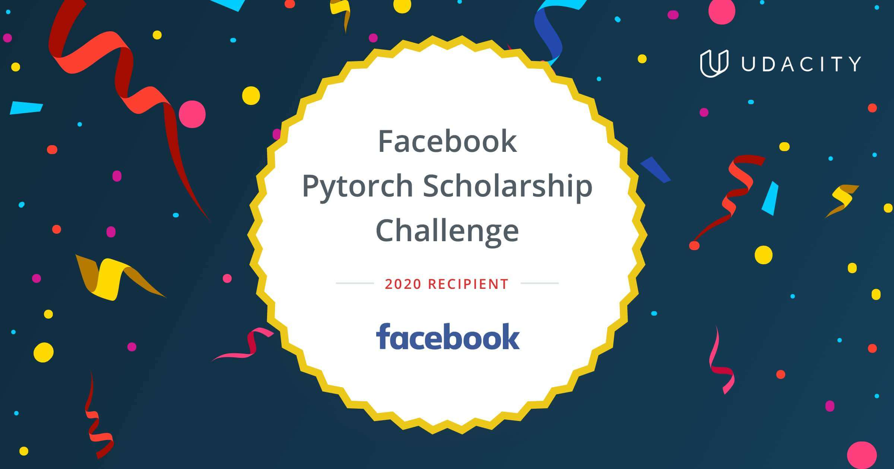

# 2.5-months-of-facebook-pytorch-scholarship
My pledge "2.5 months of Udacity" for the Facebook Pytorch Scholarship:\
https://www.udacity.com/scholarships/facebook-pytorch-scholarship

## Day 1: January 13, 2020. #30DaysofUdacity
- I entered the classroom and watched some videos.
- My current progress is:\
  **Part 1. Intro to Deep Learning with PyTorch from Facebook** (Progress 34%)\
  **Lesson 3 - Introduction to Neural Networks** (Progress 40%)\
  **1. Introduction**
- I encourage @KhushkumarP, @Jacqueline SusanM, @labibaR, @OudarjyaS, @MuhammadN, @Mohamed ChoukriB, @KonstantinosK, @AdityaK, @MahmmoudM, @LauraT, @ElenaK, @HelenaB, @RobO, @ShafaqA, @Nancy A, @TzuhsinC, @TemitopeO, @AarthiA, @NabhanA, @MD BAPPIP, @AnkitV, @fuzhanR, @Laszlo TothL. 

## Day 2: January 14, 2020. #30DaysofUdacity
- I watched some video lectures.
- My current progress is:\
  **Part 1. Intro to Deep Learning with PyTorch from Facebook** (Progress 37%)\
  **Lesson 3 - Introduction to Neural Networks** (Progress 50%)\
  **7. Why "Neural Networks"?**
- I encourage @KhushkumarP, @Jacqueline SusanM, @labibaR, @OudarjyaS, @MuhammadN, @Mohamed ChoukriB, @KonstantinosK, @AdityaK, @MahmmoudM, @LauraT, @ElenaK, @HelenaB, @RobO, @ShafaqA, @Nancy A, @TzuhsinC, @TemitopeO, @AarthiA, @NabhanA, @MD BAPPIP, @AnkitV, @fuzhanR, @Laszlo TothL. 

## Day 3: January 15, 2020. #30DaysofUdacity
- I watched some video lectures.
- My current progress is:\
  **Part 1. Intro to Deep Learning with PyTorch from Facebook** (Progress 38%)\
  **Lesson 3 - Introduction to Neural Networks** (Progress 56%)\
  **10. Perceptron Algorithm**
- I encourage @KhushkumarP, @Jacqueline SusanM, @labibaR, @OudarjyaS, @MuhammadN, @Mohamed ChoukriB, @KonstantinosK, @AdityaK, @MahmmoudM, @LauraT, @ElenaK, @HelenaB, @RobO, @ShafaqA, @Nancy A, @TzuhsinC, @TemitopeO, @AarthiA, @NabhanA, @MD BAPPIP, @AnkitV, @fuzhanR, @Laszlo TothL. 

